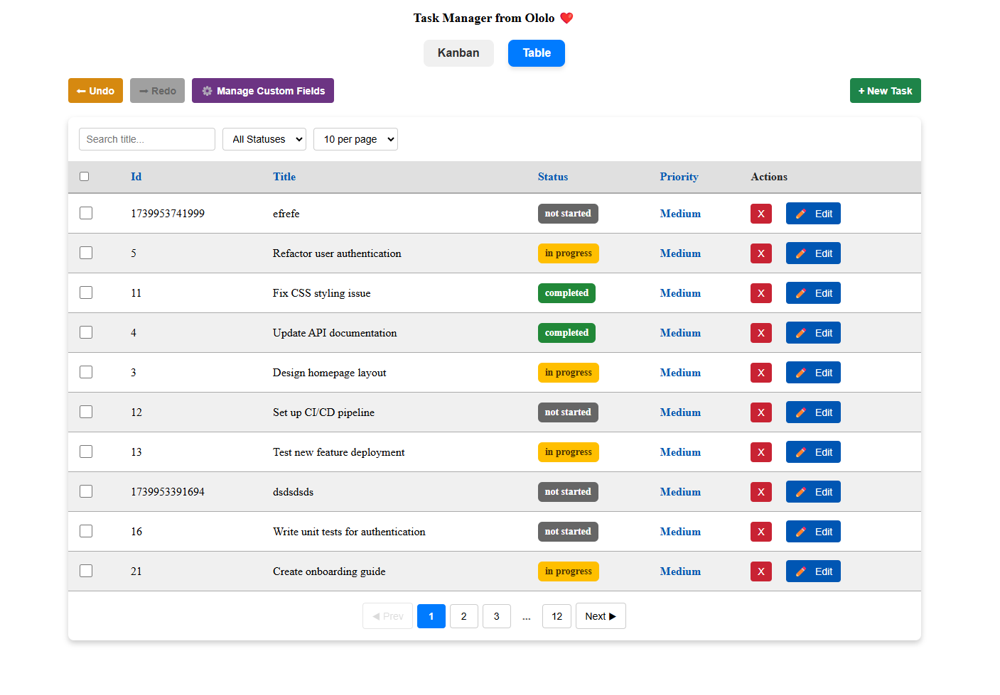
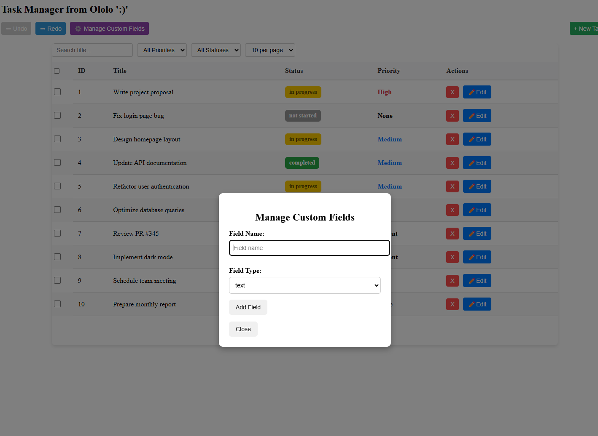

# OLOLO project

## Overview
This project is a **Task Management Application** that provides users with an interactive table to manage tasks effectively. The app allows users to **create, edit, delete, filter, sort, and paginate tasks**, as well as **manage custom fields dynamically**. Tasks are stored locally to ensure persistence across page reloads.

## Features
### 📝 **Task Management**
- **Create Tasks** via a modal or slideout panel.
- **Edit Tasks** inline or using the modal.
- **Delete Tasks** with confirmation to prevent accidental removal.

### 🔍 **Sorting & Filtering**
- **Sort** tasks by clicking on column headers.
- **Filter** tasks by title, priority, and status.
- Sorting and filtering work seamlessly together.

### 📑 **Pagination**
- Display a limited number of tasks per page (e.g., 10, 20, or 50 tasks).
- Navigate through pages via next/previous buttons and page numbers.
- Retains the current page view after CRUD operations.

### 📌 **Local Persistence**
- **Stores tasks in `localStorage`** to maintain data across sessions.
- Reads from `localStorage` on app load.
- Updates `localStorage` after each **create, update, delete** operation.

### 🔧 **Custom Fields** (Inspired by Asana & Notion)
- **Users can add, edit, or remove custom fields** (text, number, checkbox).
- Dynamic table updates when new fields are added.
- Custom fields support **sorting, filtering, and persistence**.
- Prevents **duplicate field names** and ensures schema integrity.

### 🔄 **Undo/Redo Functionality**
- Allows users to **revert** or **reapply** task modifications.
- Supports **task additions, edits, deletions, and schema changes**.

### ✅ **Bulk Actions**
- **Multi-select** tasks via checkboxes.
- Perform **bulk edits** (update status or priority).
- **Bulk delete** multiple tasks at once.
- Includes a **"Select All"** option.

## 🚀 **Getting Started**
### **1️⃣ Clone the Repository**
```sh
 git clone https://github.com/StepanNaryshkov/ololo.git
 cd task-manager
```

### **2️⃣ Install Dependencies**
```sh
 npm install
```

### **3️⃣ Start the App**
```sh
 npm start
```

## 🛠 **Tech Stack**
- **React.js** (Functional Components + Hooks)
- **Context API** (State Management)
- **LocalStorage API** (Persistence)
- **CSS (BEM Methodology)** (Styling & Animations)

## **UI**

